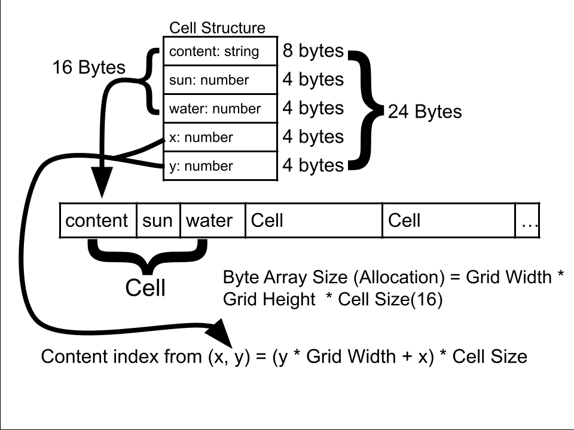

# F0 Devlog
### F0.a
    Our game satisfies this requirement as the player is able to move in four directions (up, down, left, right)
    by using w,a,s,d on a 2d grid where the player is always in a cell. 
    The player can see themselves on the grid as the "P" symbol.

### F0.b
    Our game satisfies this requirement by having a pass time button that the player can press to 
    move on to the next day. 
    The button can be identitified by the word "sleep" and increases the day  counter by 1, showing the 
    player that they have passed the time.

### F0.c
    Our game satisfies this requirement with our harvest function which checks if the player is standing on a 
    cell that has a level 3 plant which means it's ready to be reaped.
    The reaped plant is added to the player's inventory.
    The player can also plant a seed using a similar function which checks if the player's cell does not contain a plant.
    The used seed in this way is removed from the player's inventory.
    
### F0.d
    Our game satisfies this requirement because eveytime the player passes time, each cell's sunlight is 
    randomized from 1-3 and a random water level from 03 is added to each cell's water level with a maximum of 10.
    In this way, sunlight is used evey turn and is randomzied every turn while water is accumulated each turn. 

### F0.e
    Plants in our game follow a level 1, 2, 3, system where plants start at levl 1 and grow a level if 
    certain comditions are met when time is passed. Plants must be level 3 in order to be harvested.

### F0.f
    At the end of each turn, plants can grow based on their water and sunlight level, as well as neighbors. 
    Plants need at least 2 sunlight levels, and 2 water levels, and need at least one nieghboring plant.
    When a plant grows, it looses 2 water levels and increases its level with 3 being the maximum.

### F0.g
    Once the player has harvested 6 plants of any type and has them in their plant inventory, 
    the game will end and automatically restart.

### F0 Reflection
    Not much has changed so far as we kept our scope pretty small for F0 and worked with tools we were comforatble with. 
    We will probably not use photoshop for assets, in fact we currently don't have plans for any art in the game at all. 
    We are open to the possibility of having unique art assets but it will have to come much later. The only think noteworthy 
    so far is that we are being pretty liberal with our roles. if someone wants needs to be someone who works on tools, they 
    can, or is someone wants to help with design who isn't a designer, they can. 

# F1 Devlog
### F1.a
    The structure we made to store the board's data is an Array of Structures. 
    It is implemented in a new TS file internalBoard.ts. 
    The array is a Uint8Array with each entry being a 16 byte structure holding an encoded string
    representing the current Cell's contents(8 bytes), and two integers for the water and sun levels (4 bytes each). 
    The structure is filled based on the Cell interface structure (content, water and sun variables filling the previous),
    with the coordinate integers (x and y) only being used to define the location in the array, and are left out 
    of encoding to minimize memory usage. 

### F1.b
    Saving is available to the player through a save button at the bottom of the screen during play. 
    The player is able to create multiple saves and load saves by selecting from the 
    three save slots from a popup at the start of play.

### F1.c
    An auto save occurs every time a plant is placed on the screen so that minimal progress 
    is lost in the case of a disconnect. 
    Auto saves are treated the same as manual saves.
    The player can continue play from their most recent save by selecting the save slot
    they initially entered, which has the most recent state (auto or manual).

### F1.d
    Undo and Redo are options for the player with designated buttons at the bottom of the screen.
    Undo reverts the last plant placing or sleep done, and can be done until the field is empty(start of play state).
    Redo can be done as long as the player has used undos from the previous play state to get to the current play state.

### F1 Reflection
    Many of us underestimated how much time other class projects would take, and ended up trying to
    complete this project in much less time than was possible. We have decided that F1 will likely be 
    the furthest this project will go given the time. The plan for F1 was not changed, and the roles were still fluid.
